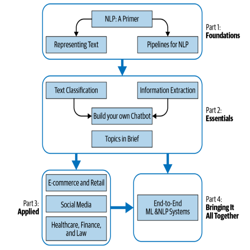

# Practical Natural Language Processing
## A Comprehensive Guide to Building Real-World NLP Systems

### **Sowmya Vajjala, Bodhisattwa Majumder, Anuj Gupta, and Harshit Surana**

## Who Should Read This Book
This book is for anyone involved in building NLP applications for
real-world use cases. This includes software developers and testers,
machine learning engineers, data engineers, MLOps engineers, NLP
engineers, data scientists, product managers, people managers, VPs,
CXOs, and startup founders.

## What You Will Learn
- Understand the wide spectrum of problem statements, tasks, and solution approaches within NLP.
- Gain experience in implementing and evaluating different
NLP applications and applying machine learning and deep
learning methods for this process.
- Fine-tune an NLP solution based on the business problem and
industry vertical.
- Evaluate various algorithms and approaches for the given
task, dataset, and stage of the NLP product.
- Plan the lifecycle of the NLP product and produce software
solutions following best practices around release,
deployment, and DevOps for NLP systems.
- Understand best practices, opportunities, and the roadmap for
NLP from a business and product leader’s perspective.

## Structure of the Book
